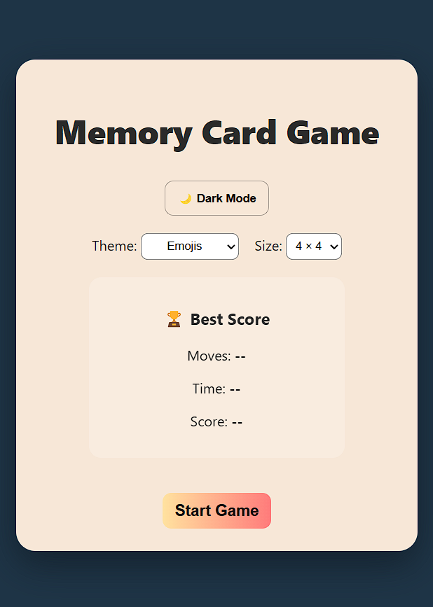
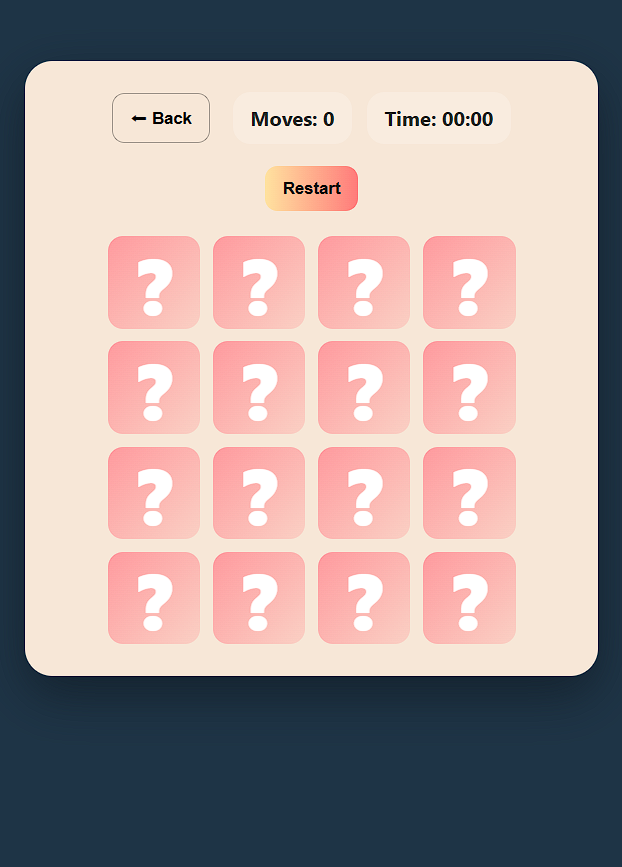

<h1 align="center">🧠 Memory Card Game</h1>

<p align="center"> 
   
  
  
</p> 

<p align="center"> 
  <b>Memory Card Game</b> is a modern, interactive, and fully responsive 
  <b>web-based memory matching game</b> built using 
  <b>HTML, CSS, and JavaScript</b>.  
  The objective of the game is to test and improve memory skills by 
  <b>matching pairs of cards in the least number of moves and time</b>.
</p>

---

## 🚀 Live Demo  
🔗 **View Project:** [🧠 Memory Card Game](https://saicharanjanagama.github.io/Memory-Card-Game/)

📸 **Preview:**  
<p align="center">
  
  
</p>

---

## 🎯 Features

- 🃏 Classic memory card matching gameplay
- 🧩 Multiple difficulty levels (4×4 & 6×6 grids)
- 🎨 Multiple themes (Emojis, Animals, Food, Pokémon-style)
- ⏱️ Real-time timer tracking
- 🔢 Move counter to measure performance
- 🏆 Best score tracking using LocalStorage
- 🌙 Dark mode toggle
- 🔄 Restart / New Game option
- 🎉 Win modal with score summary & confetti animation
- 🔊 Sound effects for card flip, match & win
- 📱 Fully responsive design (mobile, tablet & desktop)

---

## 🛠️ Technologies Used

- **HTML5**  
  *(Semantic structure, accessible layout)*

- **CSS3**  
  *(Flexbox & Grid, animations, glassmorphism UI, dark mode, responsive design)*

- **JavaScript (ES6+)**  
  *(Game logic, DOM manipulation, event handling, timers, audio effects)*

- **LocalStorage API**  
  *(Stores best score, theme selection & dark mode preference)*

---

## 🧠 How the Game Works

1. Player selects a theme and grid size
2. Cards are shuffled and placed face-down
3. Clicking a card reveals its hidden symbol
4. Two cards are compared:
   - ✅ If they match → cards remain face-up
   - ❌ If they don’t → cards flip back
5. The game tracks:
   - Number of moves
   - Time taken
6. When all pairs are matched:
   - A congratulations modal appears
   - Final score is calculated
   - Best score is saved automatically

---

## 🧮 Scoring Logic

```text
Score = 10000 − (Moves × 15 + Time × 12)
```
- Fewer moves ⬇️ → Higher score ⬆️
- Faster completion ⏱️ → Better ranking 🏆

---

## 📂 Project Structure

Memory-Card-Game/
│── index.html<br>
│── css/<br>
│    └── style.css<br>
│── js/<br>
│    └── script.js<br>
│── images/<br>
│    └── (icons, screenshots)<br>
│── README.md

---

## 🚀 How to View

To view the project locally:  
```bash
open index.html
```

---

## 👨‍💻 Author

It’s me — **Sai Charan Janagama** 😄<br>
🎓 Computer Science Graduate | 🌐 Aspiring Full Stack Developer<br>
📧 [Email Me](saic89738@gmail.com) ↗<br>
🔗 [LinkedIn](https://www.linkedin.com/in/saicharanjanagama/) ↗<br>
💻 [GitHub](https://github.com/SaiCharanJanagama) ↗
